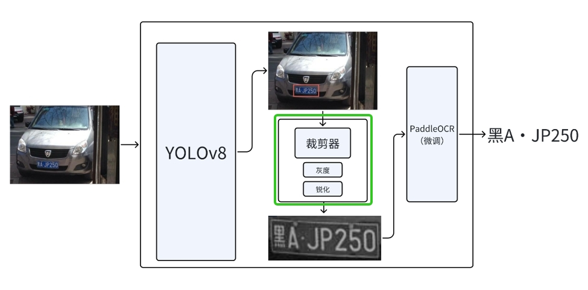
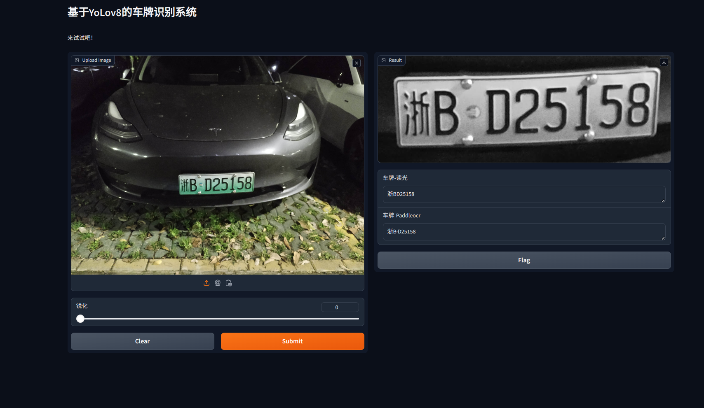

## 项目说明
本车牌识别项目采用的设计方案为[YOLOv8](https://github.com/ultralytics/ultralytics) + [PaddleOCR](https://github.com/PaddlePaddle/PaddleOCR) & [读光OCR](https://www.modelscope.cn/models/iic/cv_convnextTiny_ocr-recognition-licenseplate_damo/summary)，使用YOLOv8进行车牌的识别，利用PaddleOCR和读光OCR进行车牌检测，并利用gradio搭建了webUI，CLPD_1200的综合检测精度为92.3%。
- 其中YOLOv8的作用是识别到车牌并提取车牌关键点坐标。
- PaddleOCR和读光OCR的目的识别车牌的具体内容。（二者作用相同，只是做对比）

### 框图


### WebUI


## 配置环境

- 创建conda环境
```
    conda create -n myenv python=3.10
    codna activate myenv
```

- 拉取项目
```
    git clone https://github.com/Fakerfigure/License-Plate-Recognition-YOLOv8.git
    cd License-Plate-Recognition-YOLOv8
```

- 加载依赖项
```
    pip install -r requirement.txt
```

## ……启动！

- WebUI

*请自行调整模型路径哦！*  
```
    python main-webUI.py
```
- 跑测试集

*请自行调整文件路径哦！*
```
    python run_pictures.py
```
